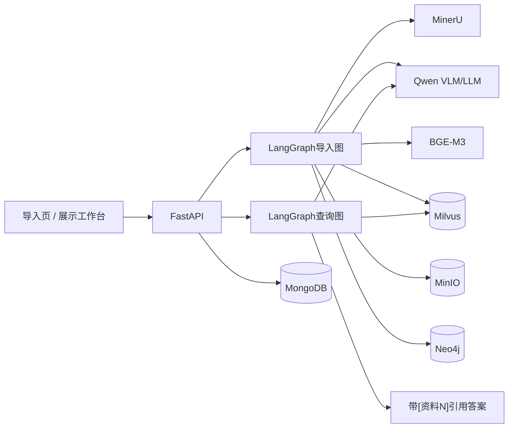
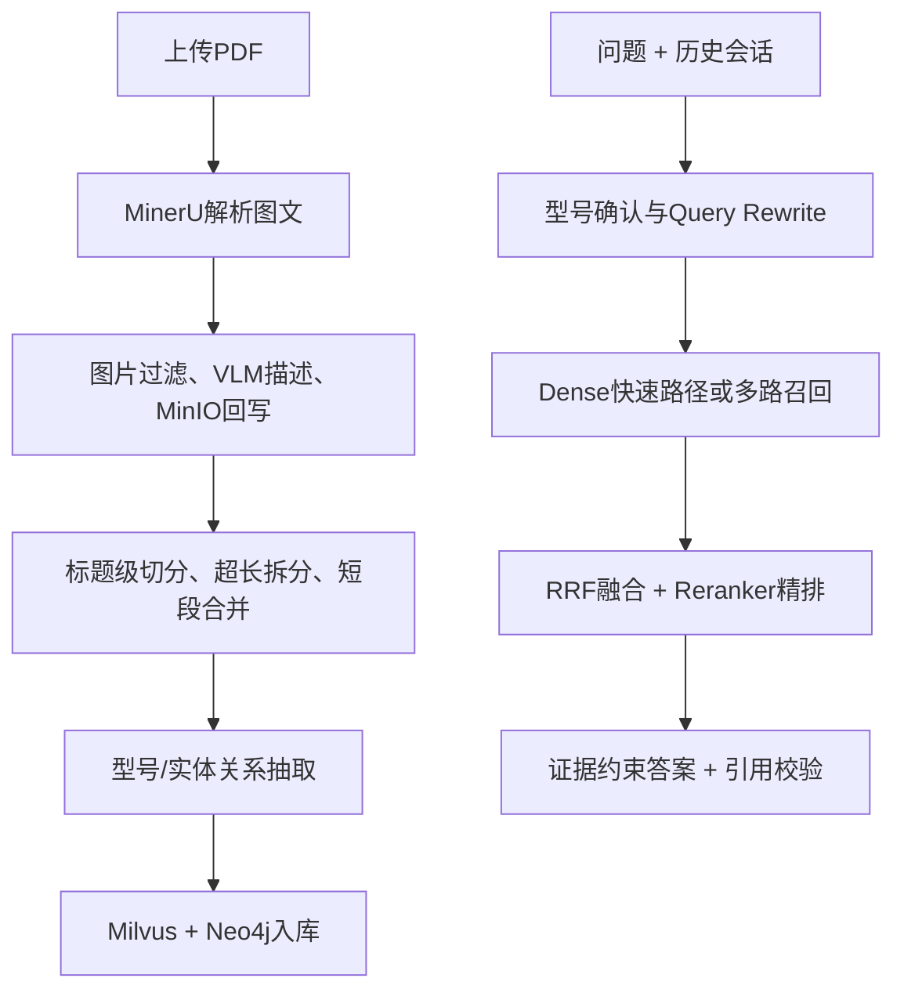
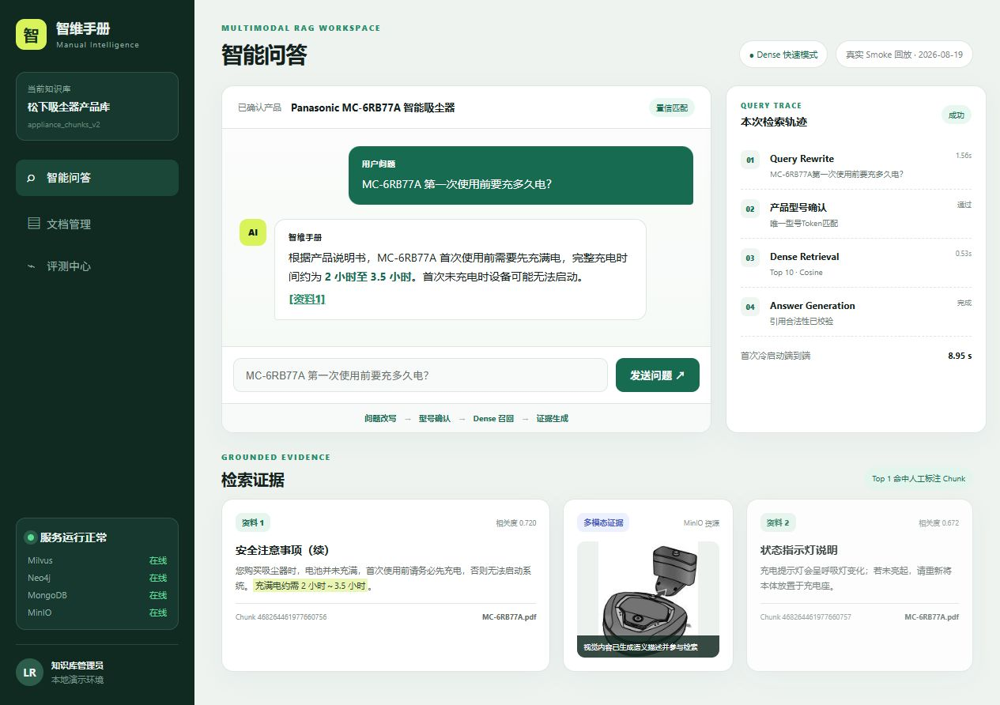
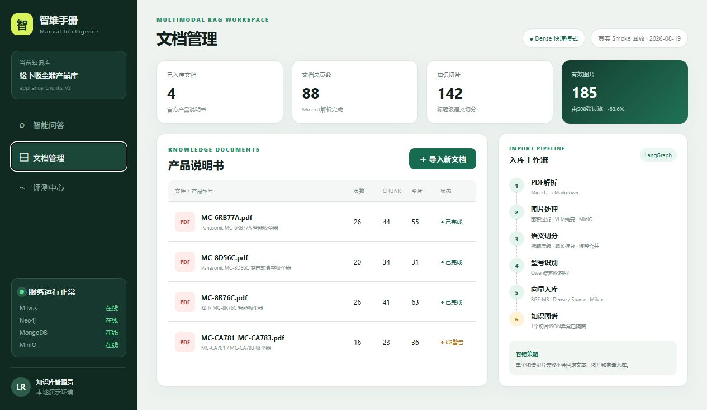
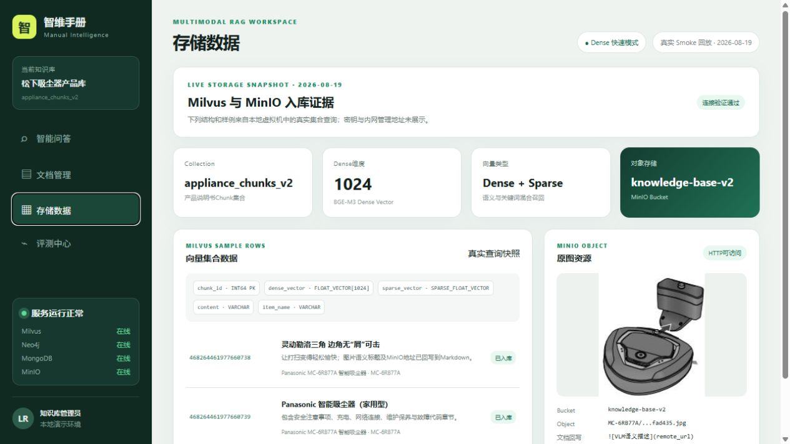
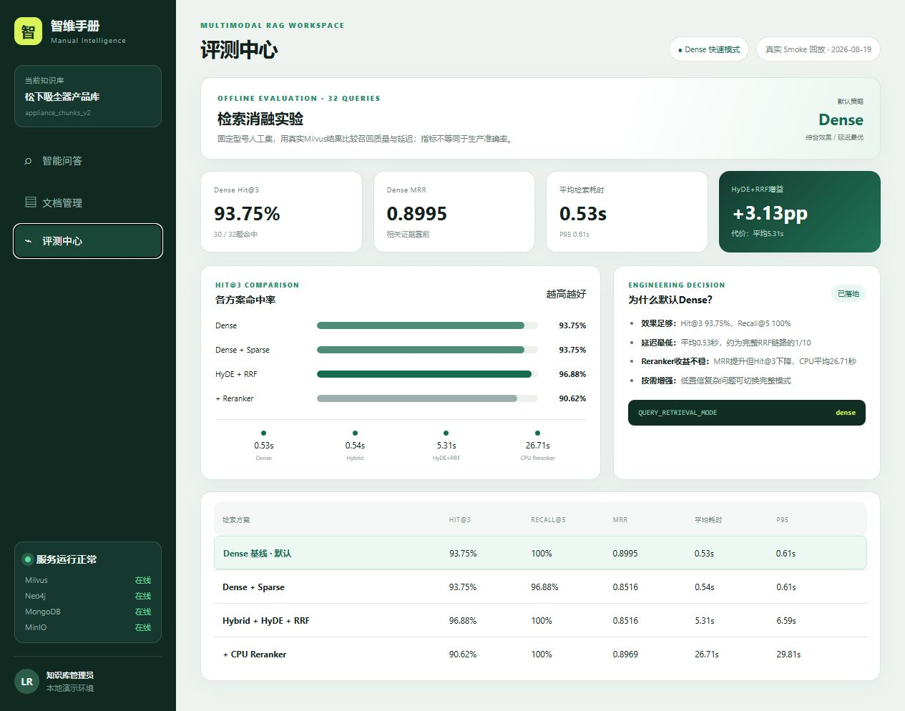
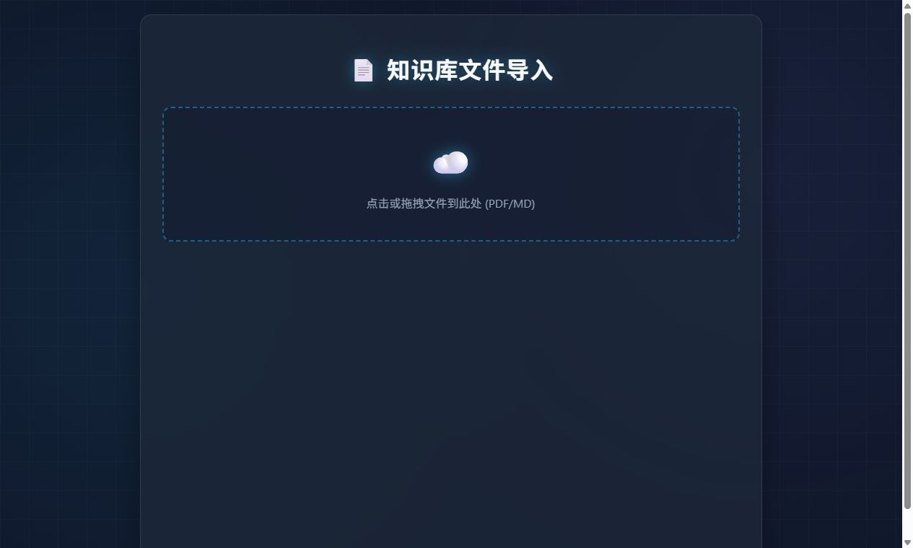

# 智维手册：产品说明书多模态知识问答系统

智维手册面向产品说明书、操作手册和故障文档，完成PDF图文解析、语义切分、型号识别、BGE-M3向量化、Milvus检索、RRF融合、Reranker精排和带`[资料N]`引用的答案生成。


## 系统架构



## 核心工作流



更完整的导入与查询流程图见[架构文档](docs/ARCHITECTURE.md)。

## 项目展示前端

`knowledge/front/dashboard.html`提供一套完整的项目展示工作台，包含智能问答、文档管理、存储数据和评测中心四个页面。当前页面使用已经保存的真实Smoke、存储快照与离线实验数据进行回放，用于GitHub和面试演示；实时查询仍由LangGraph和评测脚本执行，尚未封装为前端查询API。

### 带引用的多模态问答



### 文档、图片与入库流程管理



### MinIO图片与Milvus向量数据



### 检索消融评测中心



原始PDF/Markdown上传页面仍保留：



## 已验证结果

- 4份松下官方说明书，共88页；
- 142个知识切片；
- MinerU提取508个图片对象，过滤后处理185张，减少63.6%的无效VLM调用；
- 32题检索消融：Dense Hit@3 93.75%、MRR 0.8995、平均0.53秒；
- HyDE+RRF Hit@3 96.88%，平均5.31秒，因此默认使用Dense快速路径；
- 16题型号路由集当前准确率100%，只代表该固定小样本回归集；
- 8题答案集关键事实召回率93.75%、合法引用率100%、通过率87.5%。

完整实验见[实验报告](evaluation/reports/panasonic_experiment_report_v1.md)。

## 数据集与消融实验

数据由4份官方产品说明书和3个小规模人工评测集组成。PDF不随仓库再分发，仓库保留来源说明、4条入库记录、32/16/8题逐题结果及汇总指标，详见[数据集说明](docs/DATASET.md)。

| 检索方案 | Hit@3 | Recall@5 | MRR | 平均耗时 |
|---|---:|---:|---:|---:|
| Dense基线（默认） | 93.75% | 100% | 0.8995 | 0.53s |
| Dense + Sparse | 93.75% | 96.88% | 0.8516 | 0.54s |
| Hybrid + HyDE + RRF | 96.88% | 100% | 0.8516 | 5.31s |
| + CPU Reranker | 90.62% | 100% | 0.8969 | 26.71s |

消融结论不是“模块越多越好”：HyDE+RRF提高Hit@3但增加约10倍延迟；CPU Reranker的MRR回升但Hit@3下降且延迟过高。因此默认采用Dense，完整链路仅作为按需增强模式。

## 示例输入输出

输入：

```json
{"original_query":"MC-6RB77A 第一次使用前要充多久电？","session_id":"demo-001"}
```

真实Smoke保存结果的核心字段：

```json
{
  "item_names": ["Panasonic MC-6RB77A 智能吸尘器"],
  "top1_chunk_id": 468264461977660756,
  "answer": "首次使用前请先充满电，约需2至3.5小时。[资料1]"
}
```

## 一键离线验收

离线验收不调用API，也不要求虚拟机服务。它会运行9项核心单元测试，并检查PDF、入库清单、逐题结果和汇总指标是否一致：

```powershell
powershell -ExecutionPolicy Bypass -File .\verify_project.ps1
```

## 真实链路验收

确认虚拟机已启动，并在`knowledge/.env`中配置百炼、Milvus、Neo4j、MongoDB和MinIO后执行：

```powershell
powershell -ExecutionPolicy Bypass -File .\verify_project.ps1 -Live
```

Live模式会：

1. 验证Milvus、Neo4j、MongoDB和MinIO连接；
2. 使用`know`环境加载本地BGE-M3；
3. 调用百炼兼容接口完成型号确认和答案生成；
4. 使用Dense路径运行一条真实查询；
5. 将逐题证据保存到`evaluation/reports/live_smoke_latest.jsonl`。

请勿把`knowledge/.env`中的真实API Key提交到GitHub。

## 本地与Docker启动

本地启动导入页和展示工作台：

```powershell
conda activate know
pip install -r requirements.txt
Copy-Item .env.example knowledge\.env
python -m knowledge.upload.api.import_router
```

访问`http://127.0.0.1:8000/import`上传PDF，访问`http://127.0.0.1:8000/dashboard/dashboard.html`查看项目展示。

Docker方式：

```powershell
Copy-Item .env.example knowledge\.env
$env:MODEL_DIR="D:/models"
docker compose up --build
```

若数据库服务位于宿主机，把容器环境中的`127.0.0.1`改为`host.docker.internal`。完整镜像包含MinerU和模型依赖，首次构建时间较长；本地BGE模型通过只读Volume挂载，不打包进镜像。

## 运行完整消融

```powershell
$env:CHUNKS_COLLECTION="appliance_chunks_v2"
$env:ITEM_NAME_COLLECTION="appliance_items_v2"
$env:ENTITY_NAME_COLLECTION="appliance_entities_v2"

conda run -n know python evaluation\run_retrieval_ablation.py `
  --dataset evaluation\datasets\panasonic_vacuum_retrieval_v1.jsonl `
  --output evaluation\reports\panasonic_ablation_full_v1.jsonl `
  --summary evaluation\reports\panasonic_ablation_full_v1_summary.json
```

## 实现边界

- Neo4j当前完成实体关系入库，尚未接入查询主图；
- 默认查询模式是Dense，`QUERY_RETRIEVAL_MODE=full`才启用混合检索、HyDE、Web、RRF和Reranker；
- 当前指标来自32/16/8题小规模人工集，不等同于生产准确率；
- CPU Reranker平均约26.71秒，因此没有作为默认路径。
- 展示工作台是已保存真实证据的可视化回放，并非实时聊天前端；实时查询API和Token级SSE仍是后续计划；
- 官方PDF、本地模型、解析缓存和真实`.env`由`.gitignore`排除；
- 当前Docker Compose只编排应用，Milvus、Neo4j、MongoDB与MinIO使用已有虚拟机服务。

## 自动化测试与CI

`verify_project.ps1`运行9项核心单元测试并校验入库清单和逐题报告；GitHub Actions在不访问API、数据库和本地模型的条件下运行`evaluation/verify_offline_artifacts.py`，同时检查真实`.env`没有进入仓库。

`.env.example`只包含占位符。提交前请再次运行：

```powershell
git status --ignored
git check-ignore knowledge/.env
```

面试学习材料见[完整面试教程](docs/智维手册_完整面试教程.md)和[逐题问答](docs/智维手册_面试问题与标准回答.md)。
