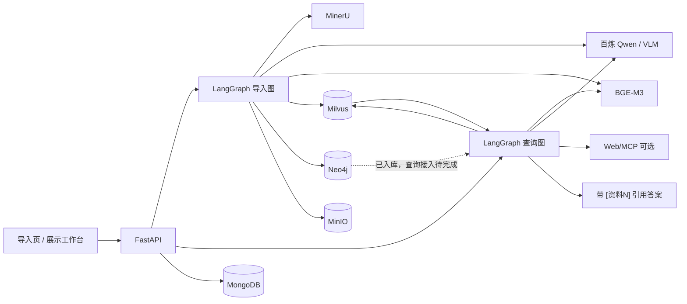
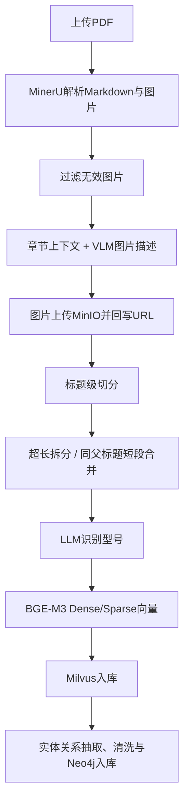
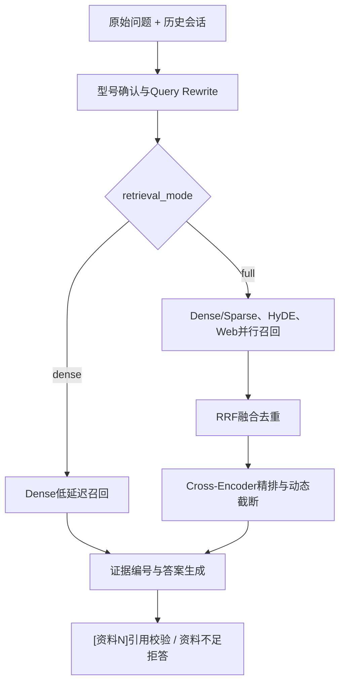

# 系统架构与工作流

## 系统架构

```mermaid
flowchart LR
    UI["导入页 / 展示工作台"] --> API["FastAPI"]
    API --> IG["LangGraph 导入图"]
    API --> QG["LangGraph 查询图"]
    IG --> MU["MinerU"]
    IG --> LLM["百炼 Qwen / VLM"]
    IG --> BGE["BGE-M3"]
    IG --> MV[("Milvus")]
    IG --> N4[("Neo4j")]
    IG --> MIO[("MinIO")]
    API --> MDB[("MongoDB")]
    QG --> BGE
    QG --> MV
    QG --> LLM
    QG --> WEB["Web/MCP 可选"]
    MV --> QG
    N4 -. "已入库，查询接入待完成" .-> QG
    QG --> OUT["带 [资料N] 引用答案"]
```

## 文档导入工作流

```mermaid
flowchart TD
    A["上传PDF"] --> B["MinerU解析Markdown与图片"]
    B --> C["过滤无效图片"]
    C --> D["章节上下文 + VLM图片描述"]
    D --> E["图片上传MinIO并回写URL"]
    E --> F["标题级切分"]
    F --> G["超长拆分 / 同父标题短段合并"]
    G --> H["LLM识别型号"]
    H --> I["BGE-M3 Dense/Sparse向量"]
    I --> J["Milvus入库"]
    J --> K["实体关系抽取、清洗与Neo4j入库"]
```

## 查询工作流

```mermaid
flowchart TD
    Q["原始问题 + 历史会话"] --> C["型号确认与Query Rewrite"]
    C --> D{"retrieval_mode"}
    D -->|dense| DS["Dense低延迟召回"]
    D -->|full| P["Dense/Sparse、HyDE、Web并行召回"]
    P --> RRF["RRF融合去重"]
    RRF --> RR["Cross-Encoder精排与动态截断"]
    DS --> G["证据编号与答案生成"]
    RR --> G
    G --> V["[资料N]引用校验 / 资料不足拒答"]
```
